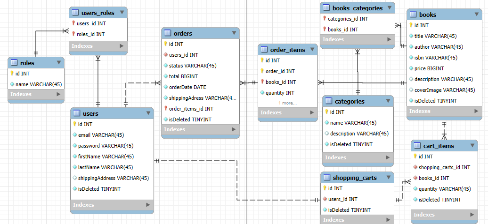

# SpringProj

## Introduction

SpringProject is a robust backend solution designed for e-commerce platforms. It offers seamless integration with modern
tools to handle user authentication, product management, and order processing efficiently. This project was inspired by
the need for a scalable and secure backend that adheres to best practices in software development.

## Features

- **Authentication**:
    - User registration and login via JWT.
    - Role-based access control.
- **Product Management**:
    - Manage products, categories, and inventory.
- **Order Management**:
    - Handle customer orders and shopping carts.
- **API Documentation**:
    - Interactive Swagger UI for exploring endpoints.

## Technology Stack

- **Spring Boot 3.4.1**: Core framework.
- **Spring Security**: For secure authentication and authorization.
- **Spring Data JPA**: Simplified database interactions.
- **MySQL**: Relational database.
- **JWT**: Token-based authentication.
- **MapStruct**: Object mapping.
- **Liquibase**: Database migrations.
- **SpringDoc OpenAPI**: API documentation.
- **Testcontainers**: Integration testing with MySQL.

## Database structure




## Installation

### Prerequisites

- JDK 21
- Maven
- MySQL Server

### Steps

1. Clone the repository:
   ```bash
   git clone <https://github.com/VasylAzarov/springproject.git>
   cd springproject
   ```
2. Configure the database in `application.properties`:
   ```properties
   spring.datasource.url=jdbc:mysql://localhost:3306/springproject_db?createDatabaseIfNotExist=true
   spring.datasource.username=YOUR_USERNAME
   spring.datasource.password=YOUR_PASSWORD
   ```
3. Build the project:
   ```bash
   mvn clean install
   ```
4. Run the application:
   ```bash
   java -jar target/springproject-1.0-SNAPSHOT.jar
   ```
5. Access the API:
    - Base URL: `http://localhost:8080/api`
    - Swagger UI: `http://localhost:8080/api/swagger-ui.html`
    - Docker URL: `http://localhost:8081/api/`
    - Docker Swagger UI: `http://localhost:8081/api/swagger-ui.html`

### Running with Docker

#### Prerequisites:

- Docker
- Docker Compose

#### Steps:

1. Create a `.env` file with the required environment variables:
   ```properties
    MYSQLDB_LOCAL_PORT=your_db_local_port
    MYSQLDB_DOCKER_PORT=your_sb_docker_port
    MYSQLDB_DATABASE=your_db_name
    MYSQLDB_USER=your_db_username
    MYSQLDB_ROOT_PASSWORD=your_db_root_password
    SPRING_DATASOURCE_DRIVER_CLASS_NAME=your_datasource_driver
    SERVER_SERVLET_CONTEXT_PATH=your_servlet_context_path
    SPRING_LOCAL_PORT=your_spring_local_port
    SPRING_DOCKER_PORT=your_spring_docker_port
    DEBUG_PORT=your_debag_port
   ```
2. Build and start the containers:
   ```bash
   docker-compose up --build -d
   ```
3. Access the API:
    - Base URL: `http://localhost:<your_spring_local_port>/api`
    - Swagger UI: `http://localhost:<your_spring_local_port>/api/swagger-ui.html`

## Controllers

### AuthenticationController

- **Endpoints**:
    - **_POST_** `/api/auth/registration`: Register a new user.
    - **_POST_** `/api/auth/login`: Authenticate and receive a JWT.

### BookController

- **Endpoints**:
    - **_GET_** `/api/books` : Get all books.
    - **_GET_** `/api/books/{id}` : Get book by id.
    - **_POST_** `/api/books/` : Create a new book.
    - **_PUT_** `/api/books/{id}` : Update book data.
    - **_DELETE_** `/api/books/{id}` : Delete book by id.

### CategoryController

- **Endpoints**:
    - **_GET_** `/api/categories` : Get Category page.
    - **_GET_** `/api/categories/{id}` : Get category by id.
    - **_POST_** `/api/categories/` : Create a new category.
    - **_PUT_** `/api/categories/{id}` : Update category data.
    - **_DELETE_** `/api/categories/{id}` : Delete category by id.
    - **_GET_** `/api/categories/{id}/books` : Get all books by category id.

### OrderController

- **Endpoints**:
    - **_GET_** `/api/orders` : Get page of user order history.
    - **_POST_** `/api/orders` : Place an order.
    - **_GET_** `/api/orders/{orderId}/items` : Get page of order items by orderId path.
    - **_GET_** `/api/orders/{orderId}/items/{itemId}` : Get order item by itemId path.
    - **_PATCH_** `/api/orders/{id}` : Patch order item status by itemId path.

### ShoppingCartController

- **Endpoints**:
    - **_GET_** `/api/cart` : Get user cart.
    - **_POST_** `/api/cart` : Add item to user cart.
    - **_PUT_** `/api/cart/items/{cartItemId}` : Update item quantity in user cart.
    - **_DELETE_** `/api/cart/items/{cartItemId}` : Delete item from user cart.

## Postman collection
[link to postman collection](https://springproject.postman.co/workspace/SpringProject-Workspace~8c470f00-7663-4779-8f0c-fecb50086022/collection/17862326-ab3be485-333b-4492-8eec-7b58461bcc1d?action=share&creator=17862326)

## API Documentation

This project uses SpringDoc OpenAPI for API documentation. Visit the Swagger UI
at `http://localhost:8080/api/swagger-ui.html` to explore the endpoints.

## Challenges

- Implementing secure JWT authentication and ensuring tokens are properly validated.
- Managing database migrations with Liquibase while maintaining data integrity.
- Configuring Testcontainers for isolated integration testing.

## Video overview
[link to loom video](https://www.loom.com/share/99573a9ff3fe4c54a6c9f1f227a0468a?sid=77c881a4-8c2b-4cad-8197-02af8683564b)
